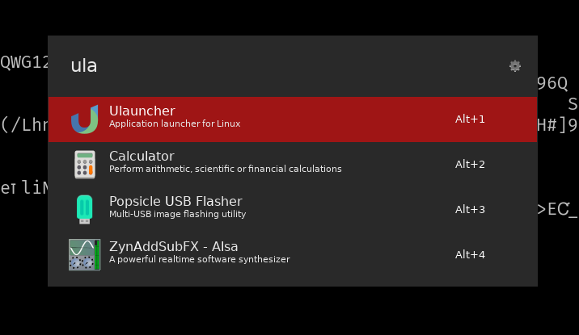

# [Yaru-dark](https://github.com/fealv/Yaru-dark-ulauncher) ulauncher theme fork

Ulauncher theme made with the dark-thinkpad-ish-red as the accent color.

If you don't have Ulauncher installed, download it from [here](https://ulauncher.io/#Download)

## Result


## Installation
Click on "code" button, download the zip file and extract it in **~/.config/ulauncher/user-themes/**

Or open the terminal and run these commands:

```sh
mkdir -p ~/.config/ulauncher/user-themes
git clone https://github.com/nikonov1101/redot-ulauncher.git ~/.config/ulauncher/user-themes/redot-ulauncher
```
